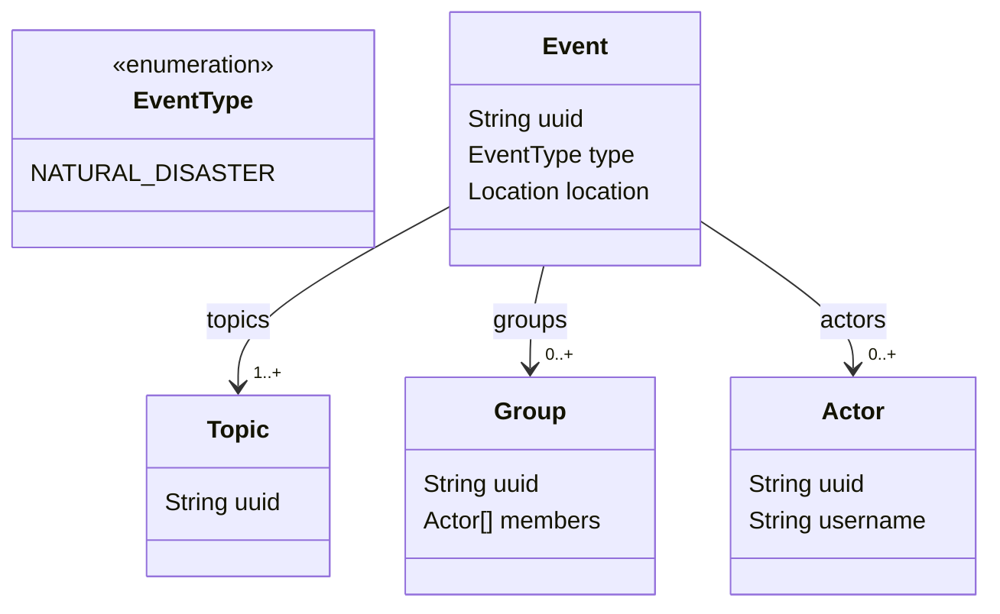

<FullSizeSection id="the-project">

# Il progetto

**ECOnnessione** nasce come contenitore di diversi contenuti che cercano di raccontare la storia dei nostri giorni in maniera più scientifica, più strutturata, più chiara nei legami e negli interessi che spingono le decisioni di chi ricopre un ruolo nelle istituzioni, nelle amministrazioni e nelle aziende.

Non c'è un solo modo di raccontare la crisi climatica in atto, le implicazioni sulle nostre vite e le cause che hanno accelerato il collasso ecosistemico, ma c'è un disperato bisogno che questi argomenti diventino il nostro focus principale, per poter comprendere le azioni da dover intraprendere per evitare il collasso.

</FullSizeSection>

<FullSizeSection id="intro">

## Informare per agire

Per comprendere le cause dell'emergenza climatica e ambientale c'è bisogno di una **corretta informazione sulla drasticità degli sviluppi futuri** unita ad una **profonda analisi personale e collettiva** per comprendere come ognuno di noi può contribuire a cambire direzione.

Il **ruolo dell'informazione** dovrebbe essere quello di fornire alle persone gli elementi per poter **comprendere** il contesto in cui vivono, ma la totale mancanza di contenuti legati all'emergenza planetaria in corso nei principali canali di informazione ha creato una *coscienza collettiva* che non include l'ambiente nel proprio contesto di decisioni.

</FullSizeSection>

<FullSizeSection id="the-problem">

### Corpetura dei media insufficiente

La comunicazione *mainstream* non tratta in maniera adeguata l'emergenza climatica e ambientale in atto, impedendo che la società percepisca la gravità e le mille sfaccettature in cui si presenta la pressione del clima che sta velocemente collassando.

### Le logiche di informazione dei mass media

Le logiche che governano l'informazione di massa non sono diverse da quelle di qualsiasi altra attività economica in questo sistema capitalista.

I canali principali sono di proprietà di grandi imprenditori - o gruppi di impreditori - che decidono cosa trasmettere e cosa no attraverso i loro mezzi.

La linea editoriale è definita dagli interessi economici dei propri finanziatori che si cerca di tutelare, ma questo fa si che l'informazione sia viziata, filtrata, mistificata quando deve trattare argomenti che mettono in discussione questi interessi.

Ne è un esempio questo numero tutto verde del [Corriere della Sera](/groups/ff477d30-d742-11ea-accf-91b459e4aeb4) in partnership con [Eni](/groups/0b36e8b0-d743-11ea-accf-91b459e4aeb4) che, dall'alto del suo 30º posto di maggiore emittore di CO2[^carbon-major-report], ci insegna la sostenibilità e l'ecologia.

L'effetto che questo modo di fare informazione - *grenwashing* in questo caso - ha sulla percezione della realtà da parte dei cittadini un effetto negativo: nel tentativo di preservare l'immagine di queste multinazionali, la realtà viene distorta e, a volte, addirittura negata, tenendo la maggior parte delle persone all'oscuro delle vere cause e delle responsabilità di questa crisi.

[^carbon-major-report]: [Carbon Majors Report 2017](../../static/media/pdf/Carbon-Majors-Report-2017.pdf)

</FullSizeSection>

<FullSizeSection id="lidea-di-informazione">

## L'idea di informazione

L'idea alla base del progetto è quella di costruire una piattaforma che diventi un punto di riferimento per conoscere la situazione attuale e comprendere come cambiarne il corso.

Unendo l'approccio scientifico a quello filosofico le risorse contenute saranno rappresentate tramite grafici, diagrammi e altri strumenti visuali utili per rappresentare dati.

Un forte peso avrà la mappatura di eventi relativi a determinate tematiche che coinvolgono attori e/o gruppi, con lo scopo di tracciare la linea temporale delle azioni svolte dai *leader* - che siano essi politici o di aziende.

</FullSizeSection>

<FullSizeSection id="il-contributo-di-tutti">

### Il contributo di tutti

La piattaforma permette la modifica e la creazione dei contenuti da parte di tutti, tramite l'*open authoring* di [Netlify CMS](https://www.netlifycms.org/docs/open-authoring/#header).

L'inserimento - o la modifica - può avvenire tramite l'interfaccia disponibile in [admin](/admin/) oppure modificando direttamente il sorgente nella propria copia locale del progetto e inviando una PR sulla [repository](https://github.com/ascariandrea/econnessione) del progetto.

</FullSizeSection>

<FullSizeSection id="timelines">

### Timelines

La costruzione di una linea temporale che evidenzi le decisioni e la narrativa di attori/gruppi richiede una classificazione della tipologia degli eventi in cui questi attori - o gruppi - possono essere coinvolti.

<NetworkExample />

#### Architecture

#### Eventi

Gli eventi di cui viene tenuto traccia sono di diversi tipi e inidicano un avvenimento in un determinato arco temporale, in cui possono essere coinvolti diversi [*gruppi*](/groups) e/o [*attori*](/actors).

Ogni evento ha almeno un [*topic*](/project/#topic) di riferimento, mentre il tipo di evento può essere:

- Declaration
- Act
- AnthropicDisaster
- NaturalDisaster
- CivilConflict
- Migration
- War

La definizione dei tipi di evento è in *work in progress* al momento poiché richiede un'analisi approfondita su quali siano davvero le metriche da considerare.

#### Opere

Le opere sono quelle trasformazioni che vengono apportate al territorio per continuare ad alimentare l'economia estrattivista.

#### Topic

I [topic](/topics) indicano un tema o un argomento specifico a cui gli eventi possono appartenere.

<BubbleGraphExample />

#### Attori

Per *attori* si intendono quelle persone fisiche che possono essere collegate ad un evento.

#### Gruppi

Per *gruppi* si intendono gli insiemi di *attori* che identificano istituzioni e aziende.

</FullSizeSection>
