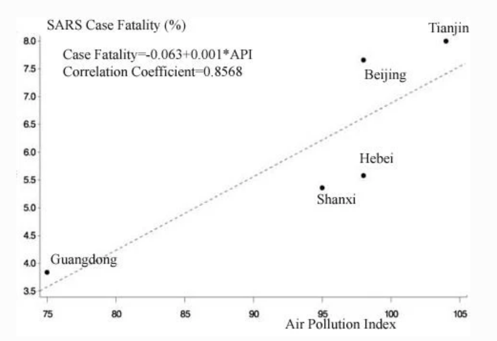
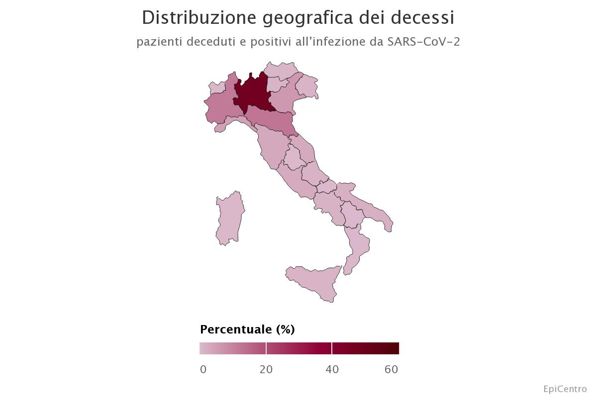

<FullSizeSection>

## Crisi ecologica

La crisi ecologica che stiamo vivendo oggi è la minaccia più grande che l'umanità abbia mai affrontato.

Le temperature si stanno alzando a ritmi spaventosi e il loro innalzamento provoca danni a catena sugli ecosistemi che danno vita al nostro pianeta.

L'avanzamento della desertificazione, i vasti incendi che uccidono animali e foreste, l'innalzamento del livello dei mari, lo scioglimento dei ghiacchiai sono solo alcune delle catastrofi che hanno giaà iniziato a manifestarsi.

</FullSizeSection>

<FullSizeSection>

## Principali cause

La principale causa dell'innalzamento della temperatura è l'aumento di concentrazione di CO2 nell'atmosfera.

Il livello degli ultimi **800 mila anni** è rimasto intorno ai _300ppm_, mentre il livello di oggi è oltre _415ppm_.
Per trovare un valore simile bisogna andare indietro nel Pliocene (5.3 - 2.6 milioni di anni fa), quando la temperatura media era più alta di 3/4ºC e gli ocenai erano più altri di 20 metri[^co2-concentration](https://climate.nasa.gov/climate_resources/7/graphic-carbon-dioxide-hits-new-high/).

<graph-selector name="co2-levels"></graph-selector>

### Le cause dell'aumento di concentrazione di CO2

Tra le cause principali dell'aumento di concentrazione di CO2 troviamo:

- combustibili fossili
- allevamenti intensivi
- deforestazione
- urbanizzazione intensiva

#### Combustibili fossili

I **combustibili fossili** che bruciamo a ritmi insostenibili sono la principale causa di emissioni di CO2, con solo 100 aziende responsabili del 70% di emissioni globali[^co2-emissions-100-corps].

<CO2LeftBudgetCounter />

#### Allevamenti intensivi

Gli **allevamenti intensivi** sono responsabili del **15-18% di emissioni di gas climalteranti globali** secondo il rapporto della FAO[^livestock-fao-report].

Nel dettaglio, le emissioni si dividono in:

- **44%** di CH4 (metano)
- **29%** di N2O (ossido di azoto)
- **27%** di CO2 (anidride carbonica)

Il **metano**, oltre ad essere il gas più rilasciato in atmosfera, ha anche la capacità di assorbimento energetica - di trattenere il calore - piú alta: si stima che possa catturare [**36 volte** l'energia catturata dalla CO2 nell'arco di un secolo](http://sitn.hms.harvard.edu/flash/2019/can-converting-methane-co2-help-reduce-climate-change/).

#### Deforestazione

La deforestazione avviene principalmente per due motivi:

- le risorse di legname, che rappresentano energia a basso costo per gli impianti di biomassa
- sfruttare il terreno sottostante per finalità antropiche (allevamenti, urbanizzazioni o grandi opere)

Questa continua estrazione di risorse e distruzione di ecosistemi è responsabile di:

- accelerare la sesta estinzione di massa, distruggendo la poca biodiversità che ormai rimane
- emettere il [20% delle emissioni totali annue di CO2](https://www.sciencedirect.com/science/article/pii/S0959378018314365)
- aumentare della possibilità di pandemie per il sempre più pressante contatto tra uomo e animali non domestici

#### Urbanizzazione Intensiva

Il grado di artificializzazione del suolo, è un altro _driver_ del cambiamento climatico.

La sola produzione del cemento riversa **1 tonellata di CO2** per tonnellata di cemento.

L'impatto, poi, di ricoprire il suolo naturale con suolo artificiale comporta una serie di problematiche che contribuiscono l'aggravarsi della condizione ecologica:

- perdita di permabilità del terreno (allagamenti, frane, smottamenti)
- perdita di assorbimento del calore solare (effetto serra)
- perdita di suolo coltivabile
- incentivo al trasporto su gomma

[^co2-emissions-100-corps]: [Carbon Majors Report 2017](../../static/media/pdf/Carbon-Majors-Report-2017.pdf)
[^livestock-fao-report]: [Tackling Climate Change Through Livestock - A globAl Assessment of emissions And mitigation opportunities](http://www.fao.org/3/i3437e/i3437e.pdf)

</FullSizeSection>

<FullSizeSection>

## Il caso Covid

La pandemia del **Covid** è la conseguenza della **perdita di biodiversità** che la specie umana continua a causare nei confronti della Vita di questo pianeta.

Nel corso degli ultimi 10 anni è aumentato drasticamente il rischio di pandemia, spingendo l'OMS a rilasciare nel 2013 un aggiornamento dei piani di prevenzione pandemici[^who-influenza-prevention](https://www.who.int/influenza/preparedness/pandemic/influenza_risk_management_update2017/en/).

### Cambiamento climatico e rischio pandemie

Come per il cambiamento climatico, le attività antropiche sono la causa dell'aumento del rischio di pandemie.

Ci sono diversi studi che collegano gli effetti del cambiamento climatico alla maggiore diffusione di virus:

- prevenzione delle pandemie grazie ad un ambiente in salute[^who-pandemic-prevention-healthy-environment](https://www.who.int/quantifying_ehimpacts/publications/preventing-disease/en/)
- la Zika e la dengue potrebbero diffondersi più rapidamente con l'aumentare delle temperature, mettendo a rischio 1 miliardo di persone[^climate-change-effects-on-zika](https://journals.plos.org/plosntds/article?id=10.1371/journal.pntd.0007213)
- il declino della biodiversità favorisce lo _spillover_ tra le specie[^wildlife-mammalian-spillover](https://royalsocietypublishing.org/doi/10.1098/rspb.2019.2736)
- la crescita econimica, l'urbanizzazione, la globalizzazione aumentano il rischio di malattie infettive in Cina[^china-infectious-disease]

### La diffusione del virus

Il Covid, dai "wet market" di Wuhan si è diffuso in tutto il mondo.

I _wet market_ sono mercati che offrono una vasta scelta di animali - o parti di animali - provenienti da ogni parte del mondo: dalle pinne di squalo alle teste di scimmia, dai cani che vengono arrostiti vivi per mantenere la carne più buona al pangolino che viene ucciso per le sue squame, che la medicina tradizionale cinese ritiene curative[^chinese-medicine-and-pangolin].

In questi mercati gli animali sono spesso tenuti in gabbie - ammassate una sopra l'altra - e macellati sul momento.

Le scarse condizioni igieniche in questi mercati non sono sufficienti ad evitare la diffusione di agenti patogeni o a prevenire il cosidetto effetto _spillover._

#### Spillover

Lo **spillover** è il cosidetto salto di specie che il virus compie per continuare a diffondersi.

Il passaggio avviene spesso attraverso i fluidi corporei che contengono tracce di virus, che una volta entrato in contatto con la nuova specie si evolve, adattandosi al corpo dell'ospite.

#### Il ruolo della globalizzazione

La **globalizzazione** è un "traguardo" che la società umana ha raggiunto negli ultimi decenni.
L'intensa interconnessione che lega ogni luogo di questa terra con un altro è anche la causa della diffusione del virus nel mondo.

Le migliaia di persone che ogni giorno attraversano gli areoporti delle grandi metropoli permettono al virus, una volta contratto, di arrivare dall'altra parte del mondo in poche ore, portando l'_epidemia_ a diventare **pandemia**.

#### Il ruolo dell'inquinamento atmosferico

L'epidemia da Wuhan si è diffusa in Iran, Korea, Giappone ed è arrivata in Pianura Padana, in particolare la Lombardia: tutte aree dove l'aria è fortemente inquinata.

Gruppi di scienziati hanno quindi pensato ci fosse una _correlazione_ forte tra diffusione del virus e il livello di inquinamento atmosferico.

Già nel 2003, uno [studio](https://link.springer.com/article/10.1186/1476-069X-2-15) sulla SARS evidenziava come la fatalità del virus aumentava in relazione alla esposizione all'aria inquinata.
Altri [studi](https://www.atsjournals.org/doi/10.1164/rccm.201804-0614ED) hanno dimostrato scientificamente invece come chi vive in aree inquinate è più soggetto a infezioni respiratorie e lo smog ne aggrava i sintomi, favorendo l'insorgere di polmoniti e problemi cardio vascolari in tutta la popolazione, bambini compresi.

In un recente [studio](https://phys.org/news/2020-09-long-term-exposure-air-pollution-china.html) si attribuiscono più di 30 milioni di morti premature dal 2000 al 2016 in China per l'esposizione prolungata all'inquinamento atmosferico.
Il danno che provoca l'inquinamento non sembra essere solo fisico, ma anche psicologico: tanto da portare al suicidio. È quello che è stato riscontrato da un altro [studio](https://pubmed.ncbi.nlm.nih.gov/29454198/) che evidenzia come il rate di suicidio aumenti per le persone che vivono in zone altamente inquinate.

##### Nella diffusione del virus

Già dalle prime settimane di lockdown sono stati pubblicati _paper_ scientifici che cercavano una _correlazione_ tra livello di inquinamento e diffusione del virus.

- [Relazione circa l’effetto dell’inquinamento da particolato atmosferico e la diffusione di virus nella popolazione](http://www.simaonlus.it/wpsima/wp-content/uploads/2020/03/COVID19_Position-Paper_Relazione-circa-l%E2%80%99effetto-dell%E2%80%99inquinamento-da-particolato-atmosferico-e-la-diffusione-di-virus-nella-popolazione.pdf) (Sima, Università di Bari, Università di Bologna)
- [SARS-Cov-2 RNA Found on Particulate Matter of Bergamo in Northern Italy: First Preliminary Evidence](https://www.medrxiv.org/content/10.1101/2020.04.15.20065995v2)
- [Particulate matter and SARS-CoV-2: A possible model of COVID-19 transmission](https://www.sciencedirect.com/science/article/pii/S0048969720350610)
- [Potential role of particulate matter in the spreading of COVID-19 in Northern Italy: first observational study based on initial epidemic diffusion](https://bmjopen.bmj.com/content/10/9/e039338)

Le conclusioni dei paper sono state riprese dai vari _media_ che hanno però aumentato la confusione che in quelle settimane avvolgeva l'argomento.

Gli studi infatti evidenziano una correlazione tra l'inquinamento atmosferico, ma non erano stati sottoposti a _peer review_ - che è alla base del metodo scientifico - e che quindi avrebbero potuto giungere a risultati diversi una volta passata quella fase.

##### Nella condizione di salute preliminare

L'inquinamento causa circa **9 milioni di morti premature l'anno** al mondo: una lunga esposizione compromette il nostro sistema respiratorio e circolatorio.

Da queste considerazioni, altri studi scientifici hanno cercato di trovare la correlazione tra **esposizione prolungata all'inquinamento atmosferico** e **tasso di mortalità** del Covid.

- [Can atmospheric pollution be considered a co-factor in extremely high level of SARS-CoV-2 lethality in Northern Italy?](https://www.sciencedirect.com/science/article/pii/S0269749120320601#bib14)
- [COVID-19 PM2.5 -
  A national study on long-term exposure to air pollution and COVID-19 mortality in the United States](https://projects.iq.harvard.edu/covid-pm/home)

Lo studio di Harvard ha analizzato i dati relativi al 98% della popolazione degli Stati Uniti, considerando quante più variabili possibili. Le conclusioni a cui arriva sono:

#### Dati Epicentro ISS

L'[analisi dei dati](https://www.epicentro.iss.it/coronavirus/sars-cov-2-decessi-italia) sulle persone decedute risultate positive al Covid in Italia mostra che:

- l'età media al momento del decesso è **80 anni**
- in Lombardia è avvenuto il **47% dei decessi** in Italia
- il **62.5%** delle persone decedute ha 3 o più patologie pregresse gravi

### Situazione sanitaria

Il Sistema Sanitario Italiano è uno dei migliori al mondo in termini di avanguardia e di accessibilità per le persone.

#### Il collasso degli ospedali

In Lombardia gli ospedali non erano pronti a reggere il carico di pazienti che il Covid ha generato, a tal punto da costruire l'[Ospedale in Fiera](https://www.raiplay.it/video/2020/05/report---L-affaire-Covid-f6898185-8654-4474-babe-b5dd8a9d4b0b.html).

### Industria e finanza

L'industria che lavora a ritmi impensabili si è dovuta fermare per permettere alle persone di tutelare la propria salute.
In Lombardia, la chiusura delle fabbriche dove si sono sviluppati i primi focolai sono tardate ad arrivare come emerso dall'[inchiesta di Report](https://www.raiplay.it/video/2020/03/Report---La-zona-grigia-d2723d6e-ca03-426f-9223-6945f1bebe50.html) del 6 Aprile 2020.
Quelle che per prime hanno chiuso sono state le piccole e medie imprese, mentre per alcune delle multinazionali non c'è stato neanche un giorno di stop.

In aziende come Amazon e Deliveroo c'è stato un aumento delle assunzioni ma con formule sempre più precarie, emergenziali e sottopagate.

### Il ruolo dei mass media

La copertura data dai canali di informazione è stata adeguata ad un'emergenza globale. La stessa che bisognerebbe dare all'emergenza ecologica che ci lascia solo 7 anni prima del punto di non ritorno.

I media hanno cercato di affrontare sia gli aspetti più scientifici del tema, spiegando come il virus si fosse originato e diffuso, sia quelli più personali di chi stava soffrendo la situazione imposta dal lockdown.

[^chinese-medicine-and-pangolin]: [Chinese Medicine and the Pangolin, Nature, 1938](https://www.nature.com/articles/141072b0)

</FullSizeSection>
